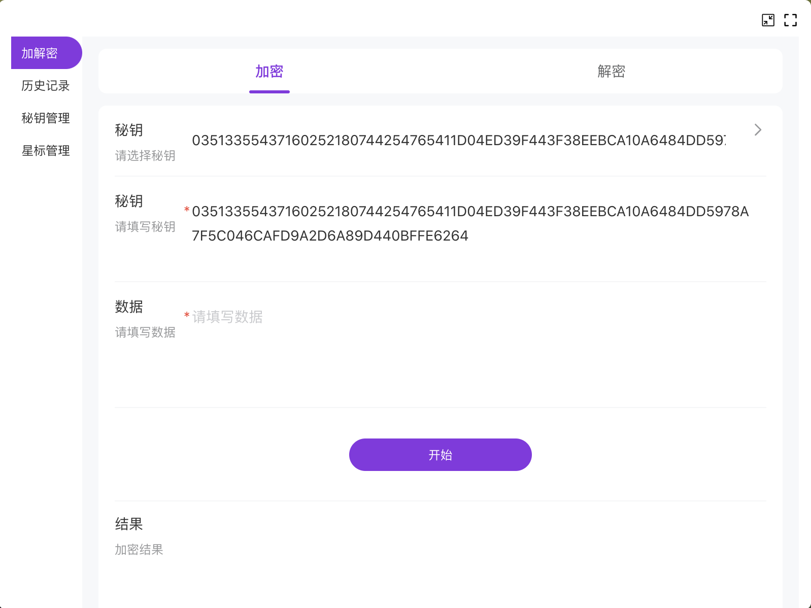

# Chrome Extension for 3DES Encrypt an Decrypt

## Installing and Running

### Install

```bash
npm install
```

### Start

```bash
npm run start
```

### Build

```bash
npm run build
```

## Resources:

- [Webpack documentation](https://webpack.js.org/concepts/)
- [Chrome Extension documentation](https://developer.chrome.com/extensions/getstarted)

> template based on: https://github.com/lxieyang/chrome-extension-boilerplate-react

## Screenshots




